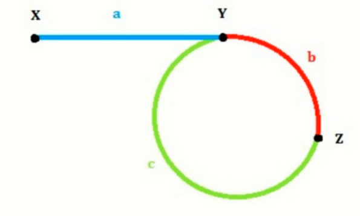

# 环形链表判断(快慢指针)

//网上不少直接给出2(a+b)=a+b+b+c的等式，但事实上考虑a远大于(b+c)的情况，可能在slow进入环之前fast已经绕地球几圈了。虽然这样的等式也不会影响我们的结论。

2(a+b)=a+b+k(b+c) -> a=c+(k-1)(b+c)

注意到b+c是环的步数即长度，把slow调整到head，这样每次步进一次下次遇见就是在环的起点(指线和圈的交点)了
